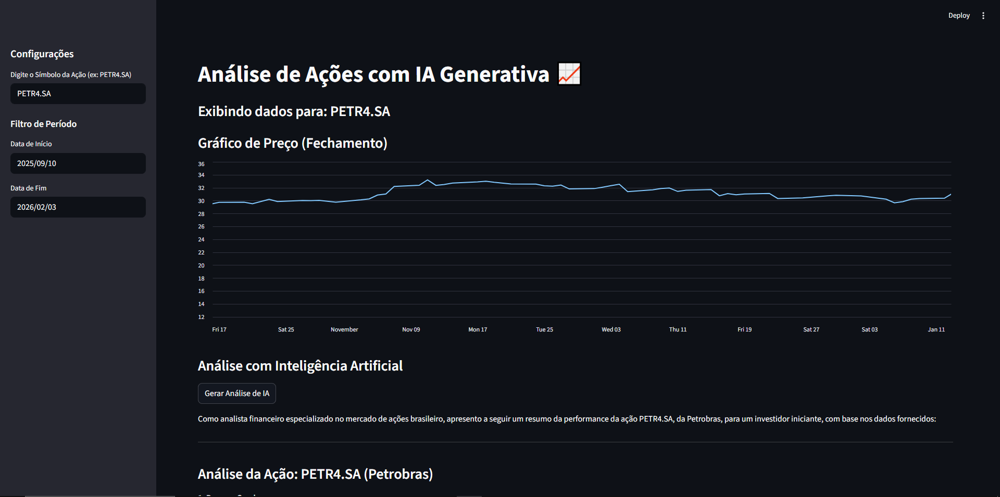

Com certeza! Um `README.md` bem escrito é a porta de entrada do seu projeto no GitHub. Ele precisa ser claro, completo e profissional para que recrutadores e outros desenvolvedores entendam rapidamente o valor do que você construiu.

Com base em tudo que desenvolvemos, preparei uma versão final e atualizada para você.

---

### Como Usar:

1.  **Copie** todo o texto abaixo.
2.  **Cole** no seu arquivo `README.md`, substituindo todo o conteúdo existente.
3.  **Personalize** as seções marcadas com `[SEU NOME]`, `[SEU-USUARIO-GITHUB]`, etc.
4.  **Tire uma nova screenshot** do seu dashboard finalizado, salve-a na raiz do projeto como `screenshot.png`, e ela aparecerá automaticamente.

---

```markdown
# 📊 Dashboard de Análise de Ativos com IA Generativa

Este projeto é um Dashboard de Inteligência de Negócios (BI) construído em Python, que permite a análise interativa de ativos financeiros, incluindo Ações e Criptomoedas. A aplicação busca dados em tempo real, exibe gráficos dinâmicos com indicadores técnicos e utiliza uma Inteligência Artificial Generativa (Google Gemini) para criar resumos e insights analíticos sobre os ativos selecionados.

O objetivo foi criar uma ferramenta de portfólio de alto impacto, demonstrando habilidades em todo o ciclo de vida de um projeto de dados: desde a coleta e tratamento até a visualização avançada e a aplicação de modelos de IA.

### ✨ Funcionalidades Principais

*   **Análise Multi-Ativo:** Suporte para Ações (via Alpha Vantage) e Criptomoedas (via CoinGecko).
*   **Dashboard Interativo:** Interface construída com Streamlit, permitindo ao usuário selecionar o ativo, o tipo, o período de análise e os parâmetros dos indicadores.
*   **Visualização de Dados Avançada:**
    *   Gráfico de preços com **Média Móvel Simples (SMA)** ajustável.
    *   Gráfico de volume de negociação.
    *   Gráfico do **Índice de Força Relativa (RSI)** com níveis de sobrecompra e sobrevenda.
*   **Análise com IA Generativa:** Integração com a API do Google Gemini para gerar uma análise técnica completa, comentando sobre preço, volume, SMA e RSI.
*   **Exportação de Dados:** Funcionalidade para baixar os dados filtrados e processados em formato `.csv`.
*   **Tratamento de Erros Robusto:** Implementação de mecanismos para lidar com falhas de conexão, limites de API e erros de certificado SSL em redes restritivas.

### 📸 Screenshot do Projeto



---

## 🛠️ Tecnologias Utilizadas

*   **Linguagem:** Python 3
*   **Dashboard Interativo:** Streamlit
*   **Manipulação de Dados:** Pandas
*   **APIs Externas:**
    *   Alpha Vantage (para dados de ações)
    *   CoinGecko (para dados de criptomoedas)
    *   Google Gemini (para análise de IA)
*   **Requisições HTTP:** `requests`
*   **Gerenciamento de Ambiente:** `python-dotenv`

---

## ⚙️ Como Executar o Projeto Localmente

Siga os passos abaixo para executar o projeto em sua máquina.

**1. Pré-requisitos:**

*   Você precisa ter o [Python 3](https://www.python.org/downloads/) instalado.
*   É recomendado o uso de um ambiente virtual (`venv`) para isolar as dependências.

**2. Clone o Repositório:**

```bash
git clone https://github.com/[SEU-USUARIO-GITHUB]/dashboard-ia.git
cd dashboard-ia
```

**3. Crie e Ative um Ambiente Virtual:**

```bash
# No Windows (PowerShell)
python -m venv .venv
.venv\Scripts\activate

# No macOS/Linux
python3 -m venv .venv
source .venv/bin/activate
```

**4. Instale as Dependências:**

Crie um arquivo `requirements.txt` na raiz do projeto com o seguinte conteúdo:

```
streamlit
pandas
python-dotenv
alpha-vantage
certifi
requests
pycoingecko
```

Em seguida, instale as bibliotecas:

```bash
pip install -r requirements.txt
```

**5. Configure as Variáveis de Ambiente:**

Crie um arquivo chamado `.env` na raiz do projeto. Adicione suas chaves de API neste arquivo (substitua os valores de exemplo):

```
ALPHA_VANTAGE_API_KEY="SUA_CHAVE_ALPHA_VANTAGE"
GEMINI_API_KEY="SUA_CHAVE_GEMINI"
```

**6. Execute a Aplicação:**

```bash
streamlit run app/main.py
```

A aplicação estará disponível em `http://localhost:8501` no seu navegador.

---

## 👨‍💻 Desenvolvido por

**[SEU NOME]**

*   **LinkedIn:** [www.linkedin.com/in/caue-macrini](https://www.linkedin.com/in/)
*   **GitHub:** [[github.com/\[SEU-USUARIO-GITHUB](https://github.com/Caue-Macrini)]

```

---
