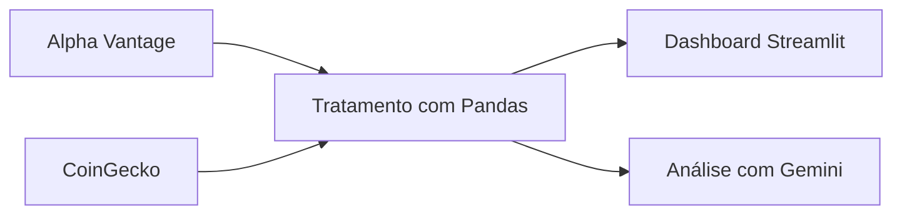

# Dashboard de Ativos com IA

[](https://github.com/Caue-Macrini/dashboard-ia/actions)

Dashboard em Streamlit para explorar ações e criptomoedas, calcular indicadores técnicos e gerar uma síntese com IA generativa.

## Funcionalidades

- Dados de ações via Alpha Vantage e criptomoedas via CoinGecko.
- Filtros por período, média móvel, volume e RSI.
- Resumo com Google Gemini e exportação em CSV.
- Testes para os cálculos, Docker e integração contínua.



## Executar localmente

```bash
git clone https://github.com/Caue-Macrini/dashboard-ia.git
cd dashboard-ia
python -m venv .venv
source .venv/bin/activate  # Windows: .venv\Scripts\activate
pip install -r requirements.txt
cp .env.example .env
streamlit run app/main.py
```

Configure no `.env`:

```env
ALPHA_VANTAGE_API_KEY=
GEMINI_API_KEY=
```

## Qualidade e segurança

```bash
pytest -q
docker build -t dashboard-ia .
docker run --rm -p 8501:8501 --env-file .env dashboard-ia
```

- As chaves são lidas por variáveis de ambiente e `.env` não é versionado.
- O projeto é educacional e não constitui recomendação financeira.
- A análise de IA deve ser validada pelo usuário antes de qualquer decisão.

## Autor

[Cauê Gaspar Macrini](https://www.linkedin.com/in/caue-macrini) · [GitHub](https://github.com/Caue-Macrini)

## Licença

MIT.
